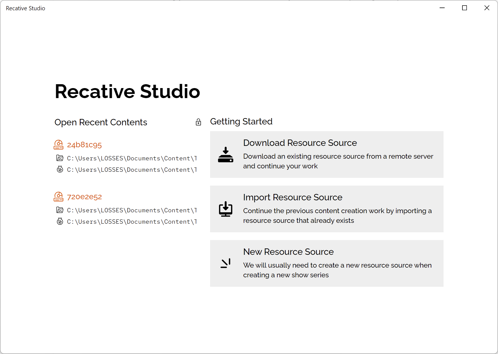
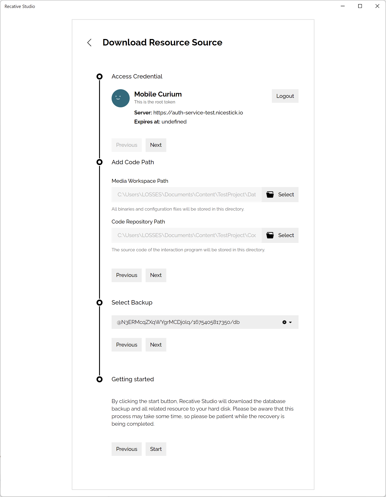

# Getting Started

The project structure of the Recative includes:

- A media folder: For saving your media files, and necessary assets, like the
  package template of the Mobile / Desktop / Web application.
- A code folder: For saving your interactive programs, Recative Studio will
  trigger the compiling command and generating bundle.

From the welcome screen of the recative system, you can select to:

- Download Resource Source: If your team have deployed the content auth service
  of the Recative System, users can backup your database to the cloud service
  and recover them, this button will navigate you to the wizard of this feature.
- Import Resource Source: Importing existing resource structures, you can select
  the media folder and the code folder from this page.
- New Resource Source: Creating a new resource source, this will help you build
  a new resource structure of the Recative System.

## Download Resource Source

To recover a cloud backup to the local device, we need to finish a recover
wizard:

### Login to the auth service

In the first step, you need to provide:

- The URL of your auth service;
- The login token provided by the maintainer of the auth service.

With these information, you'll get the right to fetch the backup list in the
following steps.

### Add Paths

In this step, you need to specify the path of your media files and code files.

Please notice that media file will be automatically downloaded from the CDN if
the resource was published while before the database is backed up, but you need
to manually clone the code, since it's not managed by the Recative Studio.

### Select backup

You need to inquiry for the product series ID and the id of the latest backup of
your database. This operation will replace your local data if the folder you
selected already has a database.

If you need to update the database later, we have a synchronize tool for you,
this feature will be introduced in the following chapters.

### Confirm your information

Now you can check all the information provided and tap the "Start" button to
download all the data from the cloud service.

Please notice once the synchronize task has started, there is no chance to
cancel the whole task, so please double check the configuration.

## Import or create new project
