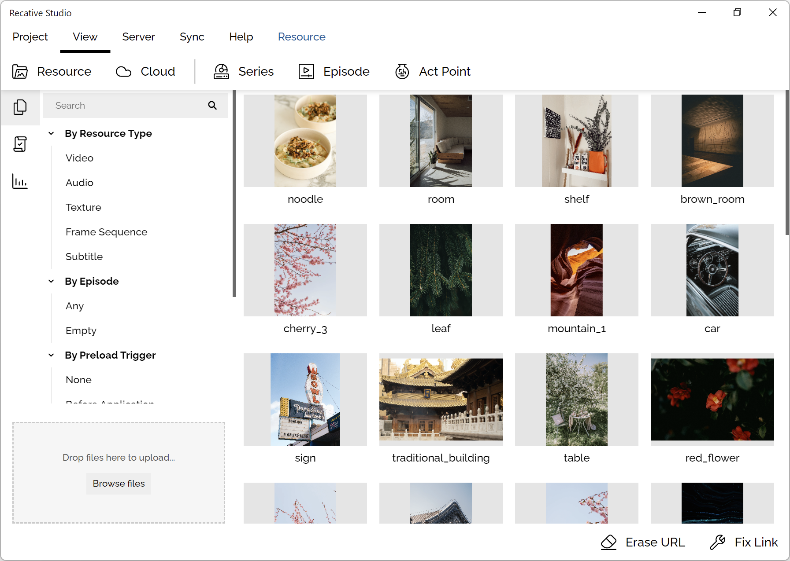
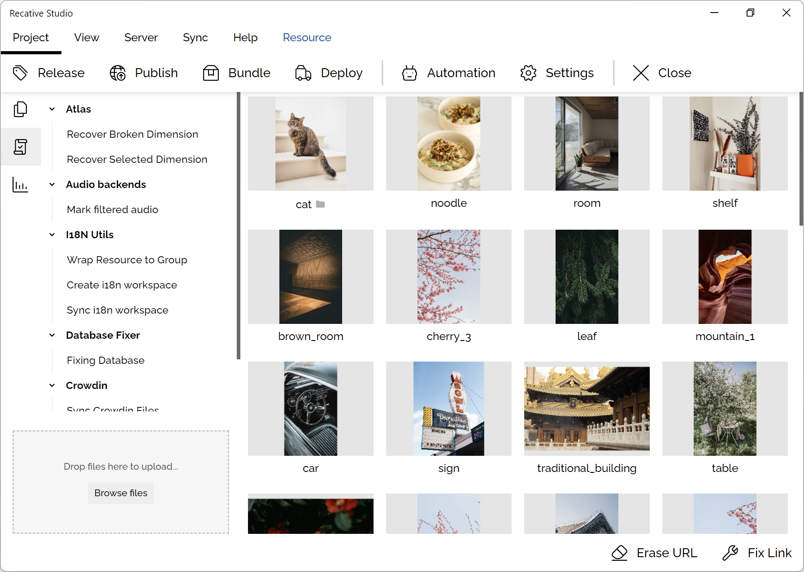
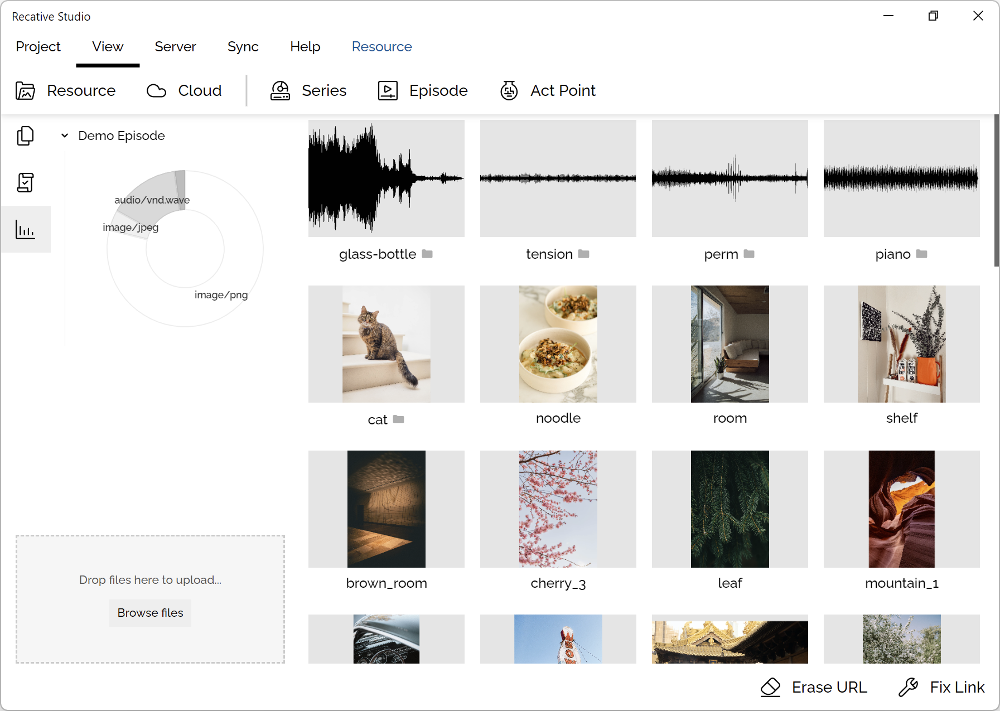

import groupingFigure from './images/resource-grouping.png';
import groupEditing from './images/group-editing.png';
import batchEditing from './images/batch-editing.png';
import resourceReplacement from './images/resource-replacement.png';

# ST0002: Resource Management

## Introduction

Resource management is the core feature of the Recative System, it serves as a
bridge between media files and other media playback and interactive program
development features. In this article, we will give a brief introduction about
how to handle resource management properly.

### Resource Import

Developers can import their resource by drag and dropping the file into the
bottom left area of the resource management window, the resource manager will
pass the file to a set of extensions to process the files, and archive them into
the manager.

### Creating resource group

Resource can be grouped by clicking the "Merge" button, after a lot of files are
imported, the system will also ask whether you want to group the files you
imported.

  

If we click "Cancel", the group won't be created, but after selecting a type of
group and clicking "Create Group", a series of extensions will be activated.
These extensions will attach metadata into your file, like for "Frame Sequence"
group, the "Atlas Extension" will analysis the file name, sort out the order
of each frame and mark the frame order automatically.

### Editing resource group

A resource group can gain the benefit of [smart resource selection](/docs/technotes/tn7003-resource-management),
developers can tune the resource tag of the resource files, inspect the uploaded
file URLs and automatically generated properties from this interface.

  

In the tag field, developers can assign multiple tags to each field, the
resource selecting library will try to match the resource in the group with
the environment variables, and pick up the resource with a highest score.

Please notice that custom tags can be manually added, this is mainly for
interactive program developers to build their customized selector, for example,
if developer need to build a "digital piano" application, we can group all
samples into a group, create a custom tag with the name of the "node" and select
the file by adding the custom selecting rule. This will make developers organize
their files more efficiently.

### Batch editing

This is a low level and advanced feature, developers can editing a lot of
metadata at once, some locked properties could also be edited in this interface.

  

Please check the document of the type definition of [`IResourceFile`](/api/definitions/interface/IResourceFile)
to make sure you filled the correct information, since there is no way to
rollback your operation, and there is no sage guard to validate your input.

The operation is organized as three elements: What, how and to.

- **What** means the field that you would like to edit.
- **How** means the type of the operation, for example, if you are editing a
  field with the type of "array", possible operations could be "add", "edit",
  or "remove".
- **To** means the operated value.

Developers can add multiple operations at once, these operations will be handled
independently one by one.

### Resource replacement

Resource could be replaced, most metadata will be inherited from the original
file but the file id will be changed to make sure when the resource file is
deployed, the old one will not be overwritten, causing problems when the
historical version of the program is loaded.

  

The operation is similar to adding resource files, clicking the "replace" button
in the pivot bar, drag and drop your file then the file will be processed by
extensions and archived.

### Other useful features

Scriptlets and bundle analysis are two features which developers may find
useful.

**Scriptlets** are small programs provided by various extensions, they provide
many useful features for developers to operate their files, like fixing
corrupted metadata, downloading files from third party services (like Crowdin).
It is available on the left side panel of the Resource view.

**Analysis** is a tool which will list a series of charts to help developers
gain a brief insight about the size of their resources, this is useful when
the developers is trying to diagnosis the data consumption and loading
performance related issue.

Please notice that the information listed here is based on the last release
that developers created, it won't be updated in realtime.

It is available on the left side panel of the Resource view.

