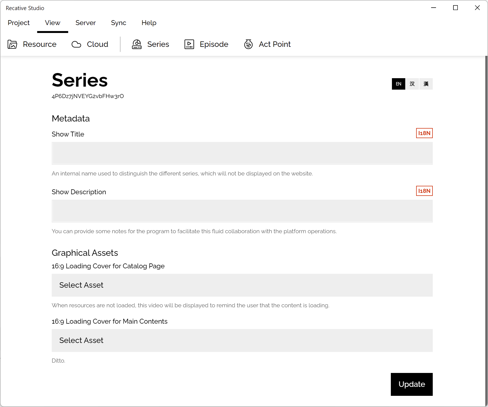
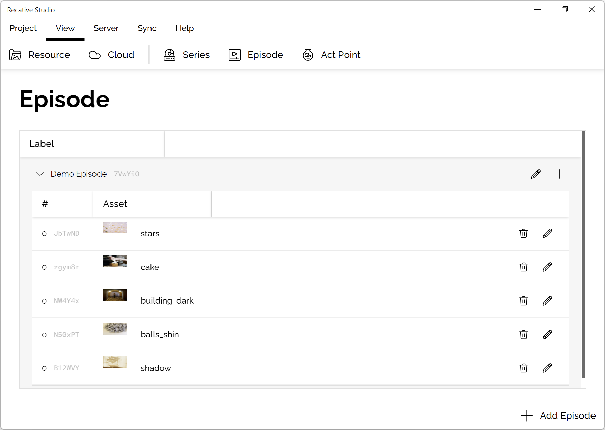

import episodeEditor from './images/episode-editor.png';
import assetEditor from './images/asset-editor.png';

# ST0003: Content Management

## Introduction

Content management includes manage the metadata of the whole series and each
single episode.

Based on the [architecture design](/docs/technotes/tn9001-project-model#introduction),
series is a "playlist" of a series of media content (like video), and episode
is a single "video" which may contains a lot of segment videos (asset), or
embedded interactive programs.

In this document, we will discuss about how to make proper configurations to
make sure your video can play correctly.

## Series Metadata

To make sure the Recative Studio could run correctly, the first task we should
do after creating a new project is to finish the metadata of the whole series.

In this form, developers need to fill in the title and description of the
series. On the top right side, there is a language switcher, developers could
select a language for your target audience and fill the data.

The graphical assets section is a platform specific feature, if your platform
didn't implement these features, it's safe to leave them blank.

## Episode Management

The episode manage view can help developers to arrange the video segments
(clips, assets) need to be played in a single episode.

The by clicking the "add episode" button on the action bar, an episode editing
modal will show up.

  

In this form, two fields is necessary: title and order.

- **Title** is an internationalized field, developers can pick the language of
  your target audience, and fill in the information. It's recommended always
  provide an English title since it is the default display language of the
  Recative System.
- **Order** this is the index of your episode, this is not only for a reference
  for the creators, the official implemented shells and some API in the AP Core
  also use this as a index to find the specific episode.

After an episode is created, developers can add assets to the episode.

  

- **Order:** The order of the segment, all the assets will be sorted by this
  field and played one by one.
- **Asset:** Could be an interactive program or an video, the popped modal will
  guide find the proper asset.
- **Notes:** A human readable note to record some useful information for other
  developers, this is not used in the Recative Player or Client SDK.

And we also provide two lifecycle control switchers:

- **Early Destroys** is a property of a content object that determines whether
  the content should be destroyed immediately when the player switches to
  another content segment. If the property is set to true, then the player will
  destroy the content instance and remove it from the DOM as soon as the switch
  occurs. This can be useful for reducing memory usage and preventing conflicts
  between different content instances.

- **preload** is a property of a content object that determines whether the
  player should preload the next content segment. If the property is set to
  true, then the player will not preload the next segment and will instead wait
  until the current segment is finished before loading the next one. This can be
  useful for reducing network usage and avoiding potential conflicts between
  multiple preloaded segments.
