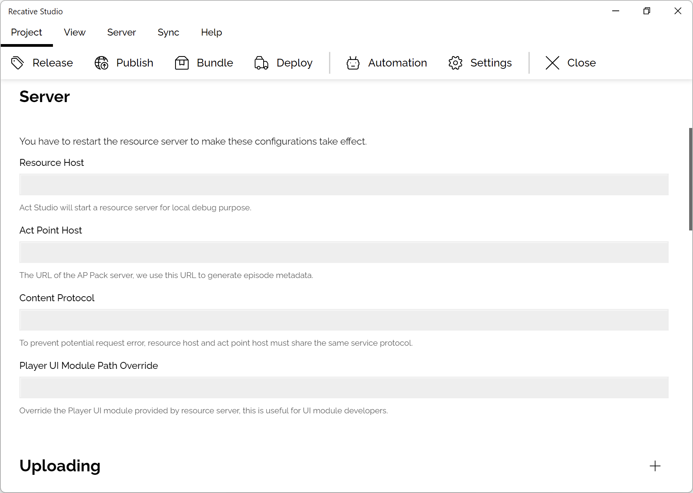

# ST0004: Interactive Program Development

## Introduction

Recative Studio supports debugging your interactive program in the realtime by
starting a resource server which will generate resource list on the fly.

This article will give a comprehensive introduction about the interactive
program development related features of the Recative System.

## Configuration

Developers needs to prepare configurations before starting their development
server.

These configurations will control how the episode details being generated for
the development profile.

- **Resource Host:** The domain or the IP address and the port of the resource
  manager server, the Recative Studio will start an HTTP server on your local
  machine with the port of `9999` by default.

:::warning
We currently do not provide a way to modify the port of the development resource
server.
:::

- **Act Point Host:** The domain or the IP address of the development server of
  the interactive program, the default value provided by `@recative/ap-pack` is
  `9000`, but if you are developing the interactive program with another
  bundling tool, the value may varies.

- **Content Protocol:** The protocol of the resource host and the act point
  host, the value could be `http` or `https`, please notice that if you decide
  to use `https`, please [setup the SSL certificates properly](/docs/studio/st1002-configuration-directory).

- **Player UI Module Path Override:** The path of the compiled customized
  interface module, it is [located in the asset directory by default](/docs/studio/st1001-assets-directory),
  but for [interface component developers](/docs/technotes/tn7004-interface-components),
  it's necessary to update the module and test if their modification works,
  in this case, we'd recommend developers override the default path to your
  output path of the bundler and execute the `watch` command, so the file could
  be updated on the fly.
