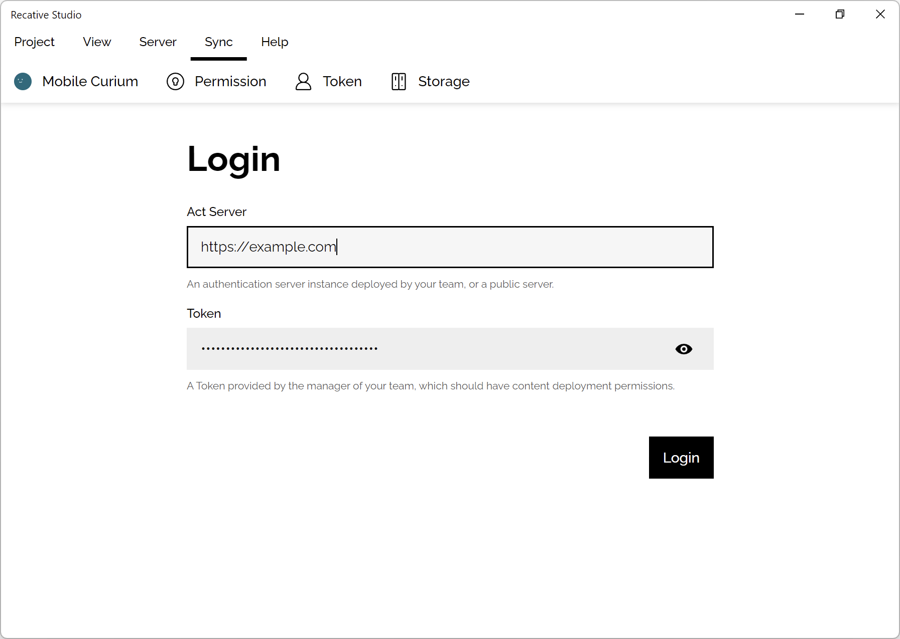
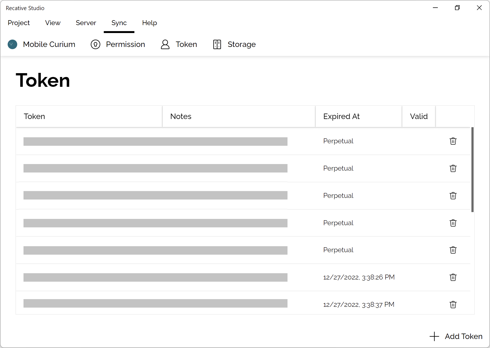
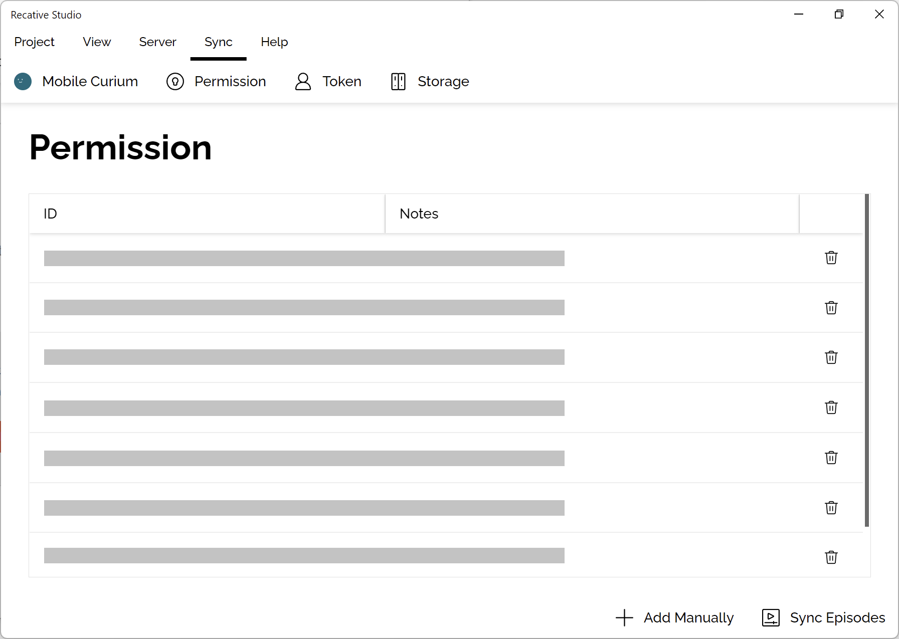

# ST0005: Content Authentication Service

## Introduction

Reactive System has implemented a content authentication service that can help
developers build a permission management system. The service enables developers
to manage the permission list, management tokens, published content, related
database backup, and assets.

Reactive Studio has integrated a management panel for the content authentication
service, which makes it easier for developers to access and manage the different
features of the service.

## Login

To use the content authentication service, you need to have a management token
provided by the service operator. Once you have the management token, you can
fill in the URL of the authentication service and gain full access to the entire
system.

## Tokens

The token manager allows developers to create new tokens for other developers.
These tokens can be used to access different features of the content
authentication service, depending on the permissions assigned to the tokens.

The tokens panel displays all available tokens and their expiration time.
Developers can use this panel to manage their tokens and revoke access if
necessary.

## Permissions

The permissions panel allows developers to fine-tune the authentication strategy
for their users with a client-side permission list. Developers can use the
permission list to specify the actions that users are allowed to perform on
different types of content.

For example, a developer can create a permission list that only allows users to
view certain types of content. The developer can then assign this permission
list to specific users or groups of users.

The permission list is a powerful feature of the content authentication service,
as it allows developers to control access to different types of content with
fine granularity.

## Conclusion

The content authentication service provided by Reactive System is a powerful
tool for developers who need to manage permissions, tokens, and content. With
the management panel integrated into Reactive Studio, developers can easily
manage their content authentication service and ensure that their users have the
appropriate access to the content they need.
