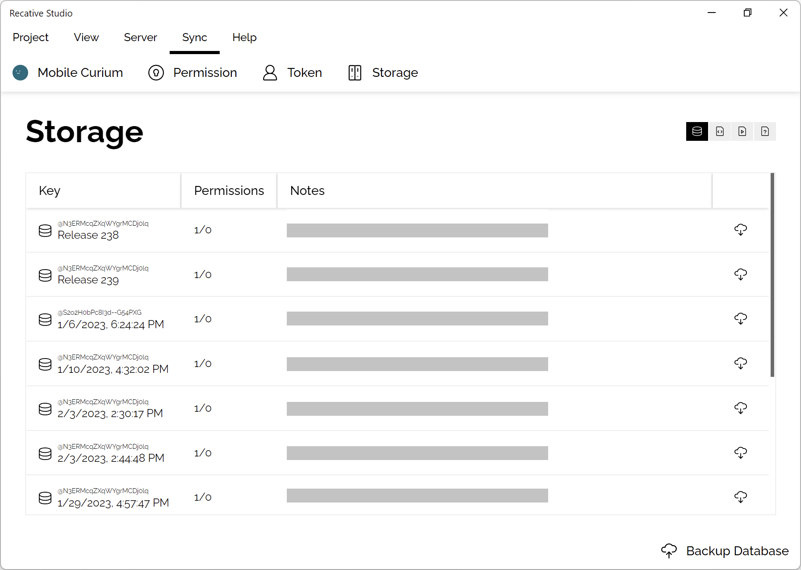

import modes from './images/modes.png';

# ST0006: Cloud Synchronization

## Abstract

This article discusses the synchronization of files in an authentication service
among different developers or devices. Additionally, it provides guidance on
backing up and recovering database and resource files using Reactive Studio.

## Database backup

Reactive Studio offers a "Backup Database" button located at the bottom right of
the backup manager to help developers backup and recover database and resource
files. This tool enables the publishing of all available resources and database
files.

Each database backup has a recovery button on the right side, which allows the
recovery of the database from the remote backup. There are three different
recovery modes provided:

  

- **Replace Old Database:** This mode entirely drops the old database and uses
  the new one instead..
- **Use New Records:** In case of conflict records, the incoming data will be
  used.
- **Use Old Records:** In case of conflict records, the existing data will be
  used.

## Asset files

If the key of the storage file ends with `/interfaceComponent`, it will be
considered as an interface component module, and listed in the assets group.
There will be a recovery button on the right side of the storage item. By
clicking it, the asset file will be automatically downloaded into the asset
directory.
