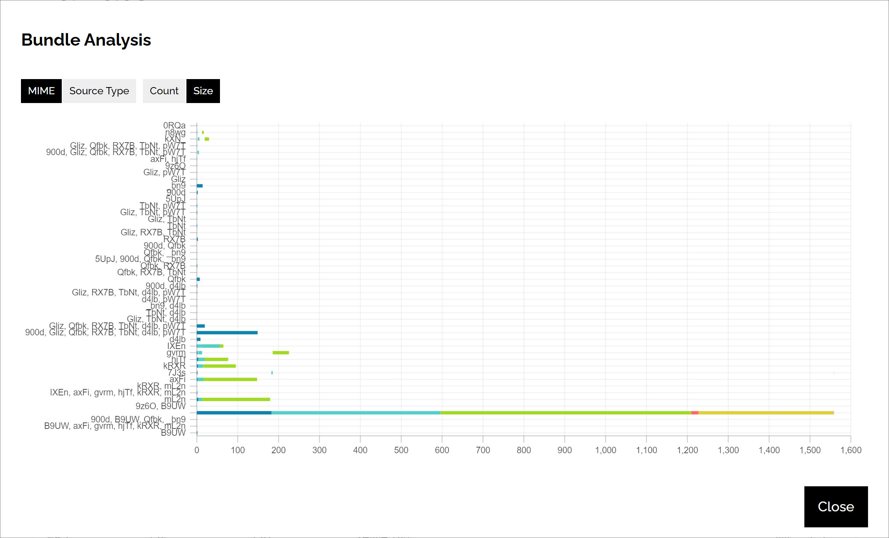

import manuallyRelease from './images/manually-release.png';
import publishModal from './images/publish-modal.png';
import bundleConfigurationA from './images/bundle-configuration-a.png';
import bundleConfigurationB from './images/bundle-configuration-b.png';

# ST0007: Releasing, Publishing, Bundling and Deployment

## Introduction

The Reactive System is a versatile solution that helps you deploy your resource
files to cloud services. Its multi-step process allows you to customize your
deployment strategy according to your needs. Let's dive deeper into each of the
steps involved in the deployment process.

- **Releasing:** The releasing step involves bundling your interactive program
  into an archive file to make sure it can be used in further steps.
  Additionally, we optimize images and videos to improve performance. In this
  step, we also generate database snapshots for metadata and cloud backup
  purposes. These snapshots ensure that your data remains consistent and share
  them with other developers.
- **Publishing:** In this step, all resource files are uploaded to cloud storage
  services. This makes them easily accessible to users and ensures that they can
  access them quickly and efficiently. The Reactive System supports various
  cloud storage services, making it easy to publish your resources to your
  preferred platform.
- **Bundling:** The bundling step involves packing your resource files into
  application bundles. This allows you to create desktop programs and mobile
  applications easily. Bundling is particularly useful for delivering resources
  to end-users in environments with limited bandwidth or where internet
  connectivity is intermittent. The Reactive System allows you to customize your
  application bundles to suit your needs, making it easy to deploy your
  resources to a wide range of devices.
- **Deployment:** In the final step, you deploy your web application or program
  bundles to cloud services to make everything available for your users.
  The Reactive System supports multiple cloud service providers, making it easy
  to deploy your resources to your preferred platform. The deployment process
  should be thoroughly tested to ensure that it works correctly and that there
  are no errors or issues.

It's important to note that creating a release is mandatory, but the remaining
three steps are optional. For example, if you're only interested in completing a
web application and don't want to create a mobile application, you can skip the
bundling step. Similarly, if you're building an application that works offline
and doesn't require any internet-connected features, you can skip the publishing
step altogether.

## Release

### Concept

A release comprises two distinct parts: the media release and the code release,
each of which has its own records.

- **Media Release** A release that contains all metadata of your resources and
  post-processed resource files. When creating a media release, the Reactive
  Studio will optimize all possible media files if there is an extension that
  can handle that.
- **Code Release** A bundle that contains the compiled result of your
  interactive program. It will automatically call the `build` script from your
  project folder and archive all the compiled result for further usage.
- **Bundle Release** is a record that stores the media release version number
  and code release version number. When publishing, bundling, and deploying, we
  need to choose a bundle release and not a media release or code release.

### Creating a release

Developers can manually create a media release, code release, and bundle release
separately from this modal. You need to specify the type of your release and
provide a human-readable note to help other developers identify the number of
your release.

  

## Publish

### Concept

The publish manager is a tool that helps you upload all your resources to either
an OSS or CDN service provider. Once your resource files are uploaded, Reactive
Studio retrieves the URLs for all the resources and saves them into the
database, making this information available for future use.

### Publishing a release

To publish a release, developers can select a bundle from the release list and
click the "Publish" button on the right side. This action triggers a modal with
guidance on what needs to be done next.

#### Selecting publish tasks

There are two types of publishing tasks available for developers to choose from:

- **Uploading media** This task uploads all media resources to either an OSS or
  CDN service.
- **Uploading database** This task backs up your database snapshots to the
  authentication service, allowing other developers to synchronize the latest work.

If developers choose to upload the media bundle, they will need to select
which cloud storage service provider to use for publication. To do this,
developers can simply check the boxes corresponding to the desired providers.

  

:::info
The CDN configuration can be accessed and modified in the settings panel.
:::

## Bundling

### Bundling profile

Developers need to configure their bundler configuration from the settings
panel, here is a brief introduction to each configurable items.

  
  

- **Label:** A user-friendly name that identifies the bundle profile we created.
- **Bundle Profile Extension:** A built-in extension that helps in creating the
  bundle file, such as "APK," "AAB," "IPA," or "Web" extension. Each of these
  extensions generates different types of bundles.
- **Package Identity:** A unique identifier for the package that is only
  recognizable by machines and not humans.
- **Output File Prefix:** The prefix added to the output file's name to make it
  easy to identify the file we created.
- **Metadata Format:** The format of metadata that is specific to each bundle
  template. Choose the correct one to ensure the program can load correctly.
- **Exclude Resource Tag:** Exclude resources with specific tags from the bundle
  to reduce the size of the bundle.
- **Build Constant File:** A configuration file that configures the bundle's
  behavior. Refer to the [asset files document for more details](/docs/studio/st1001-assets-directory).
- **Template File:** The bundle template without the web root directory. For
  instance, an Android application requires an APK template. Check the [asset files document for more details](/docs/studio/st1001-assets-directory).
- **Web Root:** The build artifacts used by the SDK. Read the [asset files document for more details](/docs/studio/st1001-assets-directory).

### Bundle Analysis

Bundle analysis allows developers to assess the size of various files in their
application and determine ways to simplify the bundle.

In this tool, you can examine the file size for each episode, categorized by the
number of files. This analysis helps to determine the total time that might be
wasted in initializing a resource. Additionally, you can review the file size,
which is used to calculate the total time that may be wasted in downloading the
resource.

### Creating a bundle

When you click on the bundle button located on the right-hand side of the bundle
manager, a modal window will appear, allowing you to select the bundling
profile.

Once you submit the form, Reactive Studio will begin packaging your bundles one
by one. Please note that this process may take some time, so we kindly ask for
your patience.

## Deploying

The process of deploying an application is similar to that of publishing media
files. To get started, you'll need to create a "Deployment Profile." Once you
have the profile set up, head to the deployment manager and select the release
and deployment profile you want to deploy. From there, Reactive Studio will take
care of the rest of the deployment process for you.
