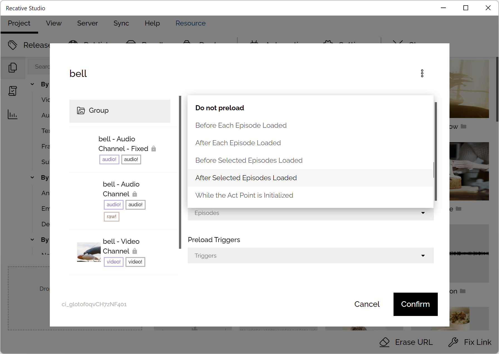

# TN7006: Resource Loading

## Abstract

Recative System provides a comprehensive mechanism to fine tune the behavior of
resource loading for both videos and interactive programs. This article will
provide a brief introduction of how resource is loaded and how can you improve
the performance of the resource loading related tasks.

## Resource loading

The resource loading related task is handled by the [`ResourceListForClient`
class](/api/core-manager/class/ResourceListForClient), while initializing the
episode, developers will provide a resource list to the React component, the
component will then pass the list to this class to index all the resources.

The `ResourceLoader` class is designed to load resources (images, videos, audio,
etc.) from URLs that are associated with labels. The class contains a dictionary
that maps labels to URLs. While loading all kinds of resources, the episode core
will firstly query the URL from the `ResourceLoader`.

### Resource querying

While querying resource item by resource ID or resource label, the method will
firstly calls the `queryItem` private method. The `queryItem` method is
responsible for finding the corresponding resource object. If a matching
resource is found, the method proceeds to the next step.

Next, the method checks the type of the resource object. If the resource is a
file and does not belong to a group, its URL is returned directly. Otherwise,
the method proceeds to the next step.

If the resource is a group, the method selects a file from the group according
to the environment configuration and weights, and returns its URL. The
environment configuration specifies the selection criteria for the files in the
group, while the weights determine the relative importance of each criterion.
The selection process is implemented in the `getResourceByResourceDescription`
method.

### URL Map

For each resource file, Recative Studio will upload it to multiple cloud service
providers, as a result, [the `url` field of the `IResourceFile` interface](/api/definitions/interface/IResourceFile#url)
became a record of string. This map is processed with the `selectUrl` method.

`selectUrl` method takes the URL map and returns a generator function that
yields URLs in a specific order. The function takes an optional
`preferredUploaders` parameter that specifies a list of uploaders that should be
prioritized when selecting a URL.

The generator function first yields the URLs that match the `preferredUploaders`
list, followed by the remaining URLs.

### Validating the URL

This task is finished by the `tryValidResourceUrl` method. When this function is
called, it starts by iterating through the URLs generated by the generator
passed to it. For each URL, it sends an HTTP `HEAD` request to check its
availability.

If the response to the request is successful (i.e., `ok` property of the response
is `true`), the function returns the URL as the valid resource URL.
However, if the request is unsuccessful, the function logs the error message
and continues to the next URL in the list.

If the generator runs out of URLs, the function throws an error indicating that
the URL is invalid.

If the `trustedUploaders` parameter is specified, the method treats all URLs
from the specified uploaders as valid and skips the availability check.

### Query Cache

The `ResourceListForClient` class caches the result of resource queries to speed
up subsequent queries. When a resource query is performed, the result is stored
in a cache object. Subsequent queries first check the cache to see if a valid
result is available. If the result is not available, a new query is performed,
and the result is stored in the cache.

## Resource Preloading

Developers could set the preload level of their resource to control when will
the resource be loaded in the Recative Studio.

Depending on the option you selected, the resource could be prefetched while
the application is launched.

### Application Initialization

The preload manager will firstly retrieves the episode data and filters the list
of resource files to only include those that have a `preloadLevel` of
`BeforeApp` or `BeforeEpisode`. These files are considered blocking resources
because they need to be loaded before the episode can start.

After all the resource are cached, the application will be launched, and all of
the non-blocking resources for the episode will be loaded in the background.
These resources includes which have a `preloadLevel` of `AfterEpisode` or
`AfterApp`.

### Interactive Program Initialization

While an interactive program is initializing, all the resources which have a
`preloadLevel` of `InsideActPoint` will be preloaded instantly, after these
files are fetched and other registered initialization tasks are done, the
lifecycle status of this interactive program will turn to `ready`, for more
retails, please check the [document of the lifecycle](/docs/technotes/tn9002-episode-core#lifecycle).
